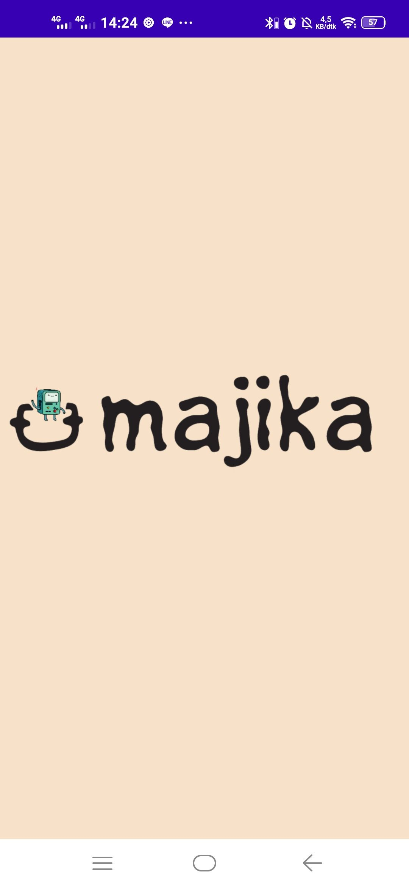
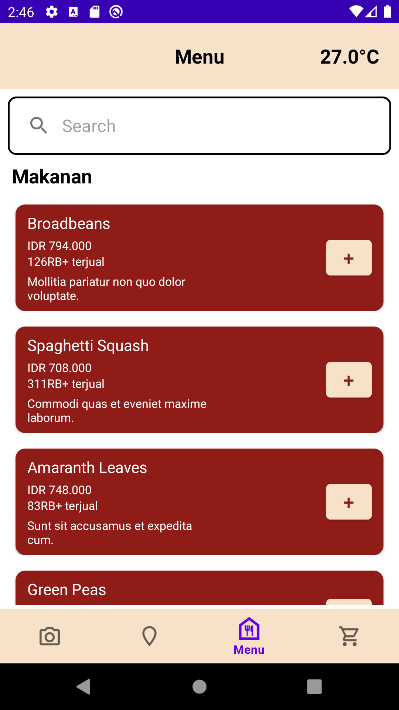
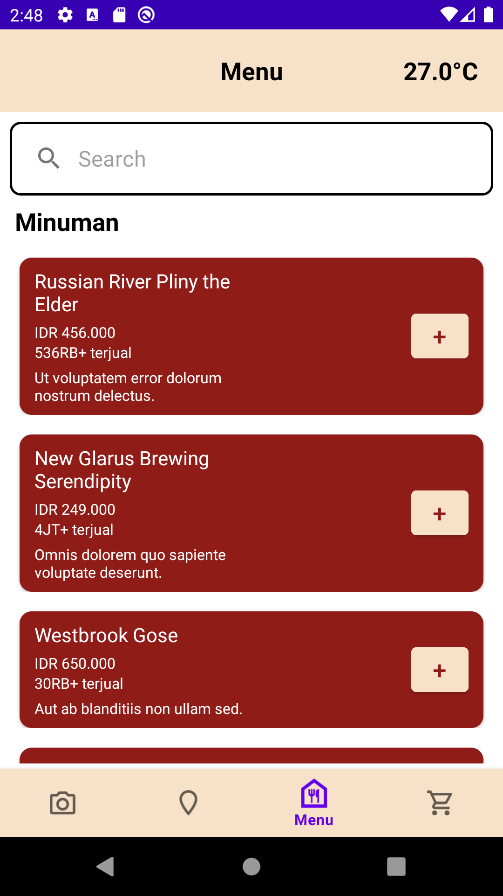
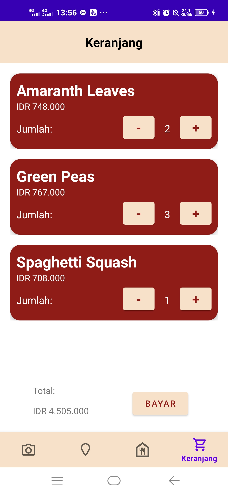
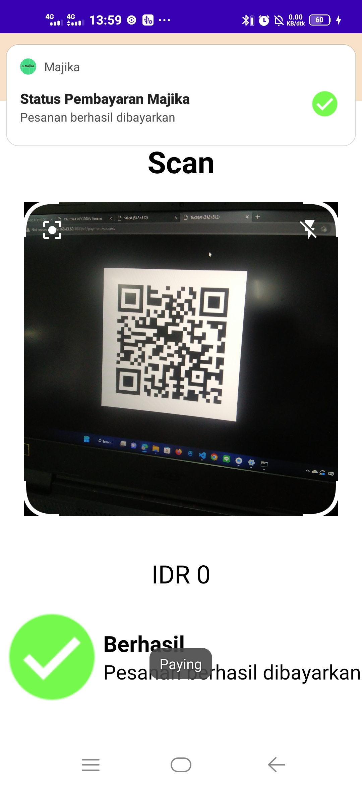
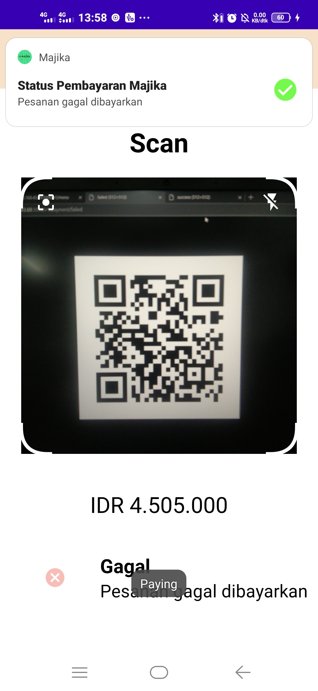
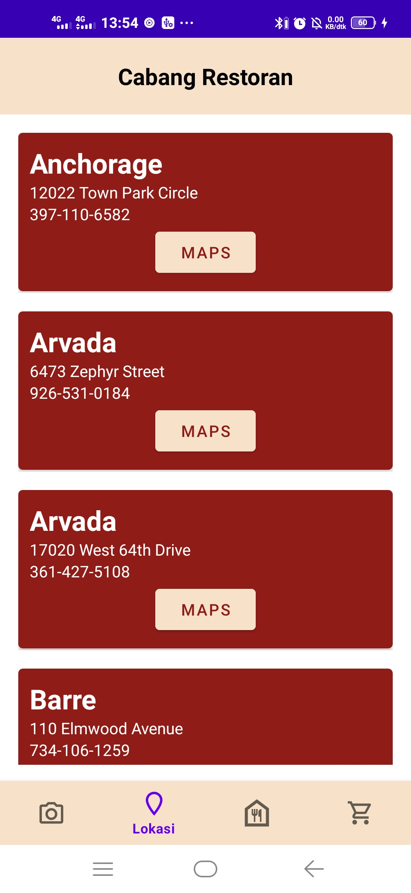
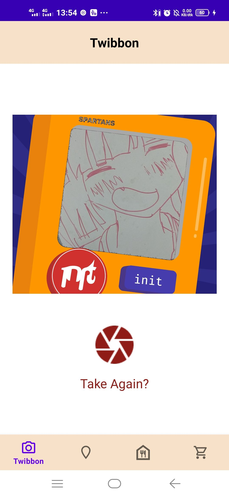

# IF3210-2023-Android-RHM - Majika

## Deskripsi

Majika merupakan sebuah aplikasi Android pemesanan menu makanan dan minuman. Pengguna dapat melakukan pemesanan makanan dan minuman serta melakukan pencarian menu makanan dan minumna. Setelah memesan, pengguna dapat melakukan pembayaran di keranjang dan melakukan scan qr code. Jika gagal, pengguna melakukan scan ulang. Jika berhasil, pengguna akan menampilkan tulisan sukses selama lima detik dan dialihkan ke halaman menu.

Pengguna juga bisa membuka halaman untuk melihat cabang restoran yang ada dan membuka lokasinya di Google Maps. Terdapat pula fitur untuk melakukan foto twibbon dan pengguna dapat melakukan pemotretan ulang, tetapi tidak dapat menyimpannya.

Pembuatan Aplikasi Majika ditujukan untuk memenuhi Tugas Besar 1 IF3210 - Pengembangan Aplikasi pada Platform Khusus

## Library

Berikut adalah library yang kami gunakan untuk membangun Aplikasi Majika

1. Code scanner by yuriy-budiyev
2. Retrofit
3. Camerax
4. Room
5. Android Navigation
6. Android Core
7. Android Material
8. Android Lifecycle
9. Android Constraint Layout

## Screenshot

### Splash Screen
   

### Menu

- Menu Makanan
  

- Menu Minuman
  

### Keranjang
   

### Pembayaran

- Pembayaran Sukses
  

- Pembayaran Gagal
  

### Cabang Restoran
   

### Twibbon

- Take Twibbon
  

- Take Again Twibbon
  

## Pembagian Kerja dan Jumlah Jam Persiapan Anggota Kelompok

| NIM      | Nama                            | Pembagian Pekerjaan                                                                       | Jumlah jam persiapan dan pengerjaan |
| -------- | ------------------------------- | ----------------------------------------------------------------------------------------- | ----------------------------------- |
| 13520057 | Marcellus Michael Herman Kahari | Navigation Bar, Keranjang, Branch Restoran, Payment, Layouting                            | 30                                  |
| 13520105 | Malik Akbar Hashemi Rafsanjani  | Splash Screen, API Backend Integration, Header Fragment, Room Repository, Twibbon, Scan Payment, Save State, Layouting | 36                                  |
| 13520117 | Hafidz Nur Rahman Ghozali       | Menu + Responsive, Pencarian, Repository, Layouting                                       | 30                                  |
